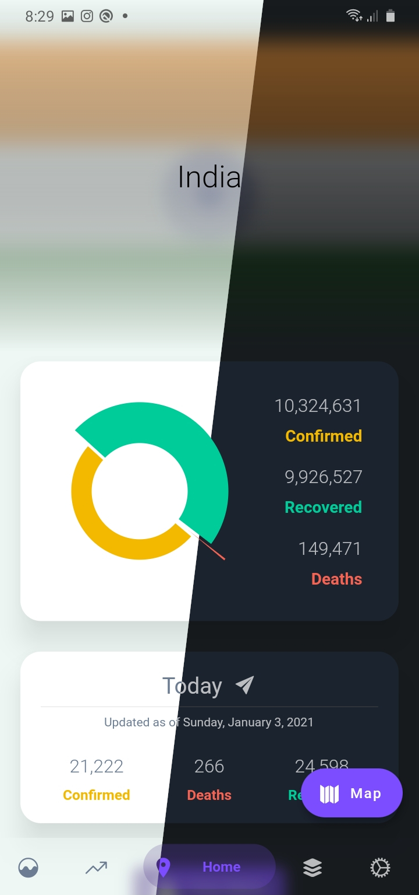
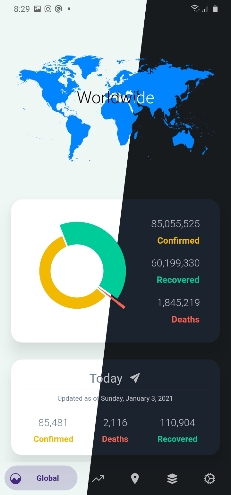
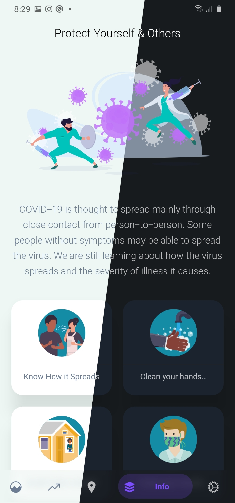
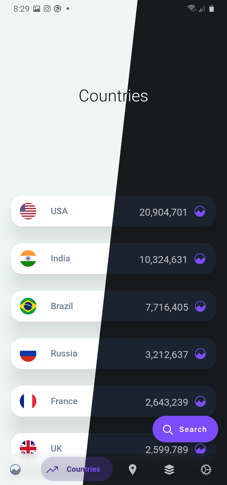

# Covid 19 Tracker

     
     
     
     

## Description

API Data is provided by [Open Disease Data](https://disease.sh/), [Centers for Disease Control and Prevention](https://www.cdc.gov/) and from [Daily updated travel advisories](https://www.travel-advisory.info/).

## Download

A covid 19 application. [Download here](https://github.com/kerrongordon/covid19/releases)
 
 

## Getting Started

This project is a starting point for a Flutter application.

A few resources to get you started if this is your first Flutter project:

- [Lab: Write your first Flutter app](https://flutter.dev/docs/get-started/codelab)
- [Cookbook: Useful Flutter samples](https://flutter.dev/docs/cookbook)

For help getting started with Flutter, view our
[online documentation](https://flutter.dev/docs), which offers tutorials,
samples, guidance on mobile development, and a full API reference.

## Support me

[Buy me a coffee](https://paypal.me/kerrongordon?locale.x=en_US)

## Packages Used

- [Dio](https://pub.dev/packages/dio)
- [Dio Http Cache](https://pub.dev/packages/dio_http_cache)
- [Flutter Icons](https://pub.dev/packages/flutter_icons)
- [Loading Animations](https://pub.dev/packages/loading_animations)
- [Cached Network Image](https://pub.dev/packages/cached_network_image)
- [Fl Chart](https://pub.dev/packages/fl_chart)
- [Intl](https://pub.dev/packages/intl)
- [Bottom Navy Bar](https://pub.dev/packages/bottom_navy_bar)
- [Adaptive Theme](https://pub.dev/packages/adaptive_theme)
- [Shared Preferences](https://pub.dev/packages/shared_preferences)
- [Url Launcher](https://pub.dev/packages/url_launcher)
- [Flutter Animator](https://pub.dev/packages/flutter_animator)
- [Lottie](https://pub.dev/packages/lottie)
- [Latlong](https://pub.dev/packages/latlong)
- [Flutter Map](https://pub.dev/packages/flutter_map)
- [Geolocator](https://pub.dev/packages/geolocator)
- [Hooks Riverpod](https://pub.dev/packages/hooks_riverpod)
- [Flutter Hooks](https://pub.dev/packages/flutter_hooks)
- [State Notifier](https://pub.dev/packages/state_notifier)
