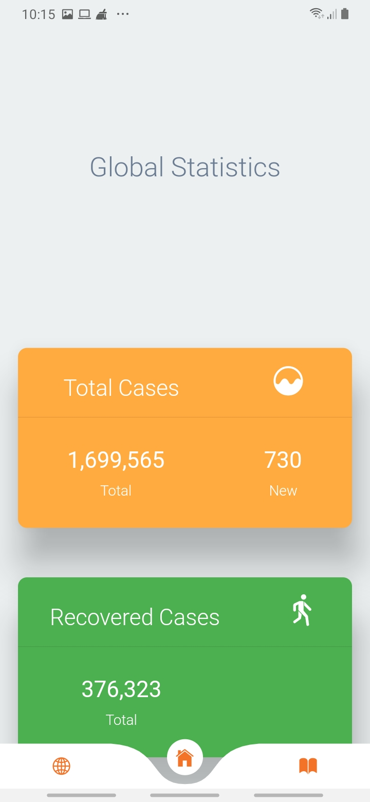
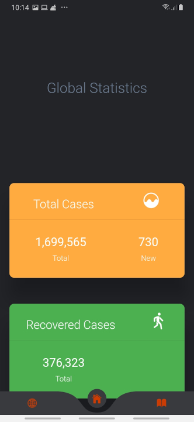
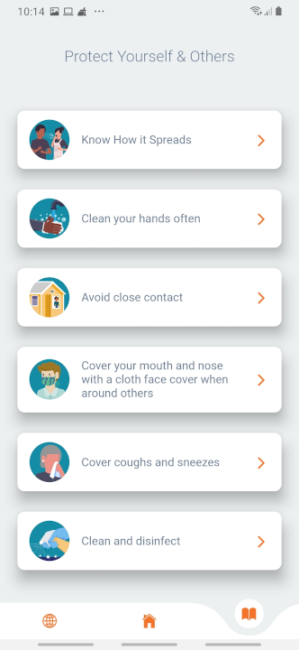
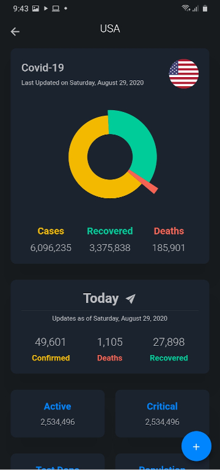

# Covid 19 Tracker

     
     
     
     

 

## Description

API Data is provided by [Open Disease Data](https://disease.sh/), [Centers for Disease Control and Prevention](https://www.cdc.gov/) and from [Daily updated travel advisories](https://www.travel-advisory.info/).

## Download

A covid 19 application. [Download here](https://github.com/kerrongordon/covid19/releases)
 
 

## Packages Used

- [Dio](https://pub.dev/packages/dio)
- [Dio Http Cache](https://pub.dev/packages/dio_http_cache)
- [Flutter Icons](https://pub.dev/packages/flutter_icons)
- [Loading Animations](https://pub.dev/packages/loading_animations)
- [Cached Network Image](https://pub.dev/packages/cached_network_image)
- [Provider](https://pub.dev/packages/provider)
- [Fl Chart](https://pub.dev/packages/fl_chart)
- [Intl](https://pub.dev/packages/intl)
- [Bottom Navy Bar](https://pub.dev/packages/bottom_navy_bar)
- [Adaptive Theme](https://pub.dev/packages/adaptive_theme)
- [Shared Preferences](https://pub.dev/packages/shared_preferences)
- [Link](https://pub.dev/packages/link)
- [Flutter Animator](https://pub.dev/packages/flutter_animator)
