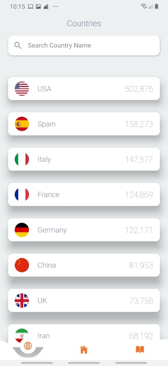
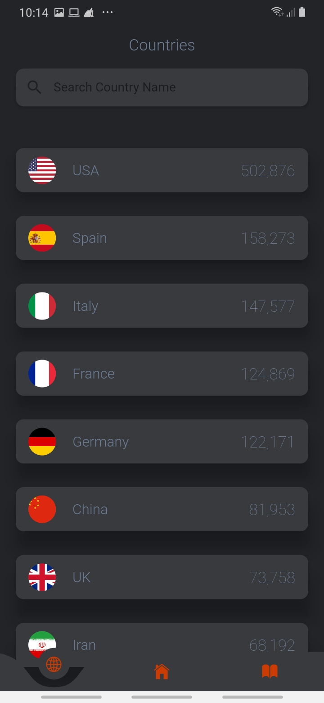

# covid19

 

A covid 19 application. [Download here](https://github.com/kerrongordon/covid19/releases)

## Getting Started

This project is a starting point for a Flutter application.

A few resources to get you started if this is your first Flutter project:

- [Lab: Write your first Flutter app](https://flutter.dev/docs/get-started/codelab)
- [Cookbook: Useful Flutter samples](https://flutter.dev/docs/cookbook)

For help getting started with Flutter, view our
[online documentation](https://flutter.dev/docs), which offers tutorials,
samples, guidance on mobile development, and a full API reference.

API Data is provided by [covid19api](https://api.covid19api.com) and from the [Centers for Disease Control and Prevention](https://www.cdc.gov/)

